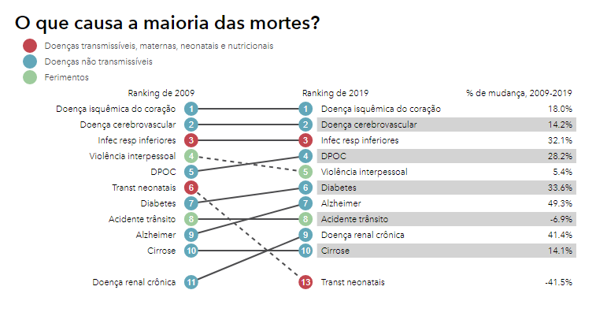

# Diagnóstico precoce de doença cardíaca / early diagnosis of heart disease

## Introdução

O termo doença cardíaca é um termo geral usado para se referir a **vários tipos de doenças que envolvem um ou mais componentes do coração**. As principais doenças cardíacas são: 

<ul>
<li>Hipertensão arterial</li>
<li>Doença coronariana (doença isquêmica do coração)</li>
<li>Doença cerebrovascular</li>
<li>Doença arterial periférica</li>
<li>Doença cardíaca reumática (doença valvar)</li>
<li>Cardiopatia congênita</li>
</ul>

 

A *doença coronariana, doença isquêmica do coração*, e a *doença cerebrobascular* são as piores doenças do gênero quando se trata de óbitos. Através da imagem abaixo, pode-se perceber a gravidade dessas doenças. A figura abaixo, retirada do site UOL sobre uma pesquisa feita em 2019, compara o número de mortes das principais doenças no mundo entre o ano de 2009 e o de 2019):

Fonte: <a href="https://www.uol.com.br/vivabem/noticias/redacao/2020/10/16/isquemia-cardiaca-foi-a-doenca-que-mais-matou-no-brasil-em-2019-diz-estudo.htm">[UOL] Doenças isquêmicas do coração foram maior causa de morte no Brasil em 2019...</a>

 

Como se pode observar, a doença coronariana e a cerebrovascular são as duas que mais matam desde 2009 até os dias atuais.

 

**Essa pesquisa foi feita desconsiderando os impactos causados pelo Corona Vírus COVID-19. Como a pandemia ainda é o contexto atual, a analise de seus impactos ainda é complexa de se realizar e por isso foi optado pela desconsideração da doença.**

 

## Objetivo desse trabalho

Sabendo da gravidade dos problemas cardíacos, o cuidado com a saúde cardíaca e a valorização do médico cardiologista são fundamentais para garantir longevidade e bem estar da população. 

Tendo isso em vista, esse trabalho visa possibilitar qualquer pessoa a fazer um diagnóstico precoce **auxiliar** e geral, ou seja, para qualquer doença cardíaca, para que o indivíduo possa ter uma noção de seu estado com relação as doenças cardíacas. A ideia é uma tentativa de diminuição do número de óbitos relacionados a essas doenças, pois o indivíduo já teria conhecimento do risco da situação em que se encontra caso esteja próximo de desenvolvê-las (obtendo diagnóstico precoce). 

O indivíduo terá seu diagnóstico auxiliar, geral e preditivo, por meio de um algoritmo de aprendizado de máquina que, ao **receber algumas informações sobre o indivíduo**, **retornará uma probabilidade daquela pessoa estar com algum problema cardíaco**. Essa probabilidade será o diagnóstico feito pelo software.

Vale ressaltar que tal diagnóstico é geral, ou seja, para qualquer doença cardíaca, e portanto, o mesmo deve ser considerado apenas um auxílio para o indivíduo que o utilizará e não como um diagnóstico definitivo. Além do mais, assim como qualquer resultado de classificação, o resultado obtido aqui pode ser um Falso-Positivo ou um Falto-Negativo, não representando de fato a realidade da pessoa analisada.

 

## Sobre os dados utilizados nesse projeto

A construção do algoritmo que realizará o diagnóstico precoce será feita apartir dos dados disponíveis no dataset [Cholesterol](https://www.kaggle.com/mathurinache/cholesterol), disponível no site do Kaggle. Tal dataset foi produzido através de dados de várias instituições, e os direitos autorais de uso do dataset estão citados logo abaixo.

Principais investigadores responsáveis pela coleta de dados de cada instituição envolvida:

1. Hungarian Institute of Cardiology. Budapest: Andras Janosi, M.D.
2. University Hospital, Zurich, Switzerland: William Steinbrunn, M.D.
3. University Hospital, Basel, Switzerland: Matthias Pfisterer, M.D.
4. V.A. Medical Center, Long Beach and Cleveland Clinic Foundation:
   Robert Detrano, M.D., Ph.D.

 

## Sobre o desenvolvimento do projeto

Para que a criação do algoritmo seja realizada corretamente, todo o desenvolvimento do projeto será composto pelas seguintes etapas:
1. Análise exploratória dos dados
    - Entendimento do dataframe
    - Limpeza
    - Tratamento e correções
    - Analisando os padrões e definindo os melhores algoritmos de Machine Learning para teste
    
     
    
2. Testando os algoritmos de machine learning definidos na etapa anterior
    - Separação dos dados para teste e treino
    - Testes dos algoritmos
    - Evaluation
    - Escolhendo o melhor algoritmo para implementação
    - Salvando o modelo definindo
    
     

3. Criação do programa com interface amigável ao usuário
    - Criação da interface de uso do software
    - Implementação do modelo de Machine Learning salvo anteriormente 
    
     

Ao final das três etapas, estará disponível o algoritmo preditivo de diagnóstico auxiliar e precoce desejado. Tal algoritmo, ao receber as características de um determinado indivíduo, retornará a probabilidade daquele indivíduo estar em uma situação de risco com relação ao desenvolvimento de doenças cardíacas.

 

## Sobre o autor

Me chamo Vinícius de Paula Pilan, sou estudante de Ciência da Computação na *Universidade Estadual Paulista - Júlio de Mesquita Filho - UNESP* e tenho muito interesse em me profissionalizar na área de Ciência de Dados. Atualmente busco aprender cada vez mais sobre o assunto e esse projeto será um meio para adquirir ainda mais conhecimento nessa área tão importante.

Agradeço pelo seu interesse no meu projeto!

 

Contato:
- Email: vinicius.pilan@unesp.br
- LinkedIn: Vinícius Pilan
- GitHub: ViniPilan
